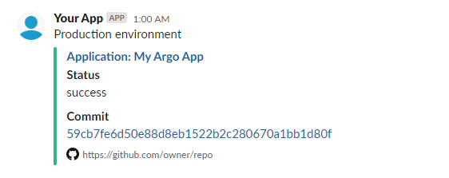

# argocd-slack-notification

To be used with ArgoCD Hooks for sending Slack attachment



## Helm templates

### `values.yaml`

```
argocd:
  enabled: true
  namespace:
  url:
  appName:
  slack:
    channel:
    pretext: # Freetext; for example identifying an enviornment "Production enviornment"
    hooks: # Hooks on which the job should be triggered
      - PostSync
      - SyncFail
...
```

### `secrets.yaml`

Provide either `argocdAdminPass` or `argocdToken` but I strongly recommended if you create a `GET` only Role in ArgoCD create static token for that role and use `argocdToken`

```
apiVersion: v1
kind: Secret
metadata:
  name: argo-hook-secrets
  namespace: {{ $.Values.argocd.namespace }}
stringData:
  argocdAdminPass: ""
  argocdToken: ""
  githubToken: ""
  slackWebhookUrl: ""
```

### `slackstatus.yaml`
```
{{- if .Values.argocd.enabled }}
{{- range $hook := $.Values.argocd.slack.hooks }}
apiVersion: batch/v1
kind: Job
metadata:
  generateName: slack-commit-status-
  namespace: {{ $.Values.argocd.namespace }}
  annotations:
    argocd.argoproj.io/hook: {{ $hook }}
    argocd.argoproj.io/hook-delete-policy: HookSucceeded
spec:
  template:
    spec:
      containers:
      - name: slack-status-post
        image: ilirbekteshi/argocd-slack-notification
        env:
          - name: ARGOCD_HOOKSTATE
            value: {{ $hook }}
          - name: ARGOCD_SERVER
            value: {{ $.Values.argocd.url }}
          - name: ARGOCD_APP
            value: {{ $.Values.argocd.appName }}
          - name: ARGOCD_TOKEN
            valueFrom:
              secretKeyRef:
                name: argo-hook-secrets
                key: argocdToken
          - name: SLACK_WEBHOOK_URL
            valueFrom:
              secretKeyRef:
                name: argo-hook-secrets
                key: slackWebhookUrl
          - name: SLACK_CHANNEL
            value: {{ $.Values.argocd.slack.channel }}
          - name: SLACK_PRETEXT
            value: {{ $.Values.argocd.slack.pretext }}
      restartPolicy: Never
  backoffLimit: 4
---
{{- end }}
{{- end }}
```

If you use Admin password then change
```
- name: ARGOCD_TOKEN
  valueFrom:
    secretKeyRef:
      name: argo-hook-secrets
      key: argocdToken

to 

- name: ARGOCD_ADMIN_PASS
  valueFrom:
    secretKeyRef:
    name: argo-hook-secrets
    key: argocdAdminPass
```
